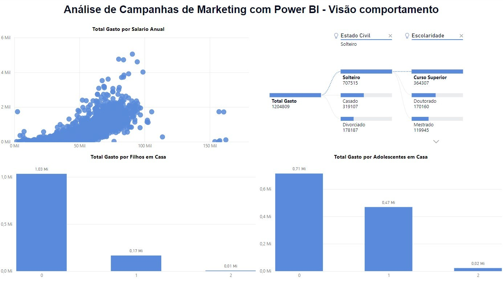

# Análise de campanhas de marketing com Power BI
 
Olá, pessoal! Hoje eu quero compartilhar com vocês um projeto que eu elaborei usando o Power BI para analisar as campanhas de marketing de uma empresa fictícia. O objetivo desse projeto foi criar um dashboard interativo e dinâmico que permitisse aos gestores e analistas de marketing terem uma visão ampla e detalhada do desempenho das suas ações e do perfil dos seus clientes.

O projeto foi dividido em quatro visões principais, cada uma focada em um aspecto diferente da análise de marketing. Vou explicar brevemente cada uma delas a seguir:

# Visão do cliente:
Nessa visão, eu mostrei as características demográficas e socioeconômicas dos clientes, como idade, gênero, escolaridade, estado civil, país, salário médio anual, etc. Também mostrei os hábitos de compra dos clientes, como o total de compras em lojas físicas, na web, com desconto ou via catálogo, permitindo filtrar os dados por qualquer uma das variáveis além de permitir um filtro por país.

# Visão do comportamento de compra do cliente:
Nessa visão, eu mostrei o total gasto pelos clientes em cada canal de venda e em cada categoria de produto. Também mostrei a relação entre o gasto dos clientes e as suas características demográficas e socioeconômicas, usando gráficos de dispersão, linha e hierarquia. Essa visão permitiu identificar quais são os segmentos de clientes mais rentáveis e quais são as suas preferências de consumo.

# Visão da performance das campanhas de marketing:
Nessa visão, foram mostrados os resultados das campanhas de marketing realizadas pela empresa, como o número de clientes alcançados, a média de salário dos compradores e o perfil de cada cliente. Essa visão permitiu avaliar quais são as campanhas mais bem-sucedidas e quais são as áreas de melhoria.

# Visão dos padrões de compra no ponto de venda (País):
Nessa visão, eu mostrei os padrões de compra dos clientes nos pontos de venda físicos da empresa, que estão localizados em diferentes países. Foi mostrado o total gasto pelos clientes em cada país e em cada categoria de produto, usando gráfico de colunas agrupadas e linhas. Essa visão permitiu entender quais são os mercados mais lucrativos e quais são as oportunidades de expansão.

A base de dados utilizada foi disponibilizada pelo curso gratuito do Data Science Academy, com o nome de Microsoft Power BI Para Business Intelligence e Data Science.
Espero que este artigo tenha sido útil para você.